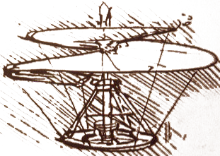
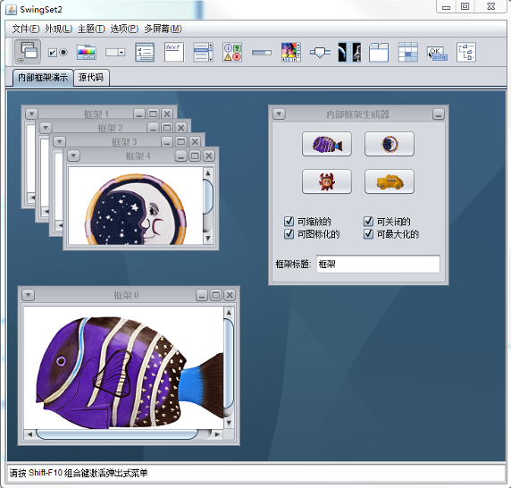

# JDK 7 新特性 - 总览

本文源自 [IBM Developer](https://www.ibm.com/developerworks/cn/java/j-lo-jdk7-1/index.html)

## JDK7 新特性系列之一 总览

JDK 全称 Java Development Kit，是一套供 Java 开发人员使用的软件开发工具，其中包括了 JRE(Java Runtime Environment)，以及 Java、Jar、Javac、 Javap、Javah、Javaws 等工具。自从 Sun 公司于 2006 年 12 月 11 日发布 JDK6 到 Oracle 公司于 2011 年 7 月 28 日发布 JDK7，历时长达 5 年之久，期间经历了不少大大小小的事件。所以首先，让我们来回顾一下 JDK7 发展历史上的风风雨雨。

2009 年 1 月，Sun 开始开发 JDK7 Milestone 1。

2009 年 11 月，Sun 在 Devoxx 2009 大会上宣布将闭包特性加入 JDK7，并将 JDK7 的发布日期推迟到 2010 年底。

2010 年 4 月，Oracle 收购 Sun。

2010 年 9 月，Mark Reinhold 在 JavaOne 大会上宣布 JDK7 将砍去 Lambda、Jigsaw 和部分 Coin 新特性并于 2011 年中发布，其余部分的新特性将于 2012 年底同 JDK8 一同发布。

2010 年 10 月，IBM 宣布加入 OpenJDK，将与 Oracle 合作共同开发 JDK。此后，Apple 和 SAP 也陆续加入 OpenJDK 社区。

2011 年 7 月 28 日，Oracle 正式发布 JDK7，并指定 OpenJDK7 为参考实现。

2011 年 9 月 19 日，IBM 正式发布 IBM JDK7。

在经历了推迟发布，Sun 被收购，新特性删减，再推迟发布等一系列事件之后，JDK7 终于还是来到了大家的面前，那么 JDK7 到底有哪些重要的新特性呢？本系列文章将为读者逐一展现。

## JSR292：支持动态类型语言（InvokeDynamic）

图 1. 项目图标－－达芬奇设计的直升机


近年来越来越多的基于 JVM 的动态语言的出现，对于 JVM 提出了新的需求和挑战。其实在 JDK6 中就已经支持 JSR223：Java 平台上的脚本语言，通过一个脚本语言引擎在 JVM 上执行 JavaScript 等脚本语言。但由于 JVM 本身的设计原来是针对 Java 这种静态类型语言的，所以脚本语言无论是解释执行，或者是编译时用虚拟类型，还是运用反射机制，都会对执行效率产生很大程度的影响。

JSR292 的实现增加了一个 InvokeDynamic 的字节码指令来支持动态类型语言，使得在把源代码编译成字节码时并不需要确定方法的签名，即方法参数的类型和返回类型。当运行时执行 InvokeDynamic 指令时，JVM 会通过新的动态链接机制 Method Handles，寻找到真实的方法。

有了 InvokeDynamic，动态类型语言在 JVM 上的执行速度得到了大大提升，具体的实现细节和实例将在今后的系列文章中有详细介绍。

## G1 垃圾回收器（Garbage-First Collector）

G1 垃圾回收器是一个服务器端的垃圾回收器，针对大内存多核 CPU 的环境，目的在于减少 Full GC 带来的暂停次数，增加吞吐量。从长远来看，G1 会代替 Concurrent Mark-Sweep Collector（CMS）。实现上，G1 在堆上分配一系列相同大小的连续区域，然后在回收时先扫描所有的区域，按照每块区域内存活对象的大小进行排序，优先处理存活对象小的区域，即垃圾对象最多的区域，这也是 Garbage First 这个名称的由来。G1 把要收集的区域内的存活对象合并并且复制到其他区域，从而避免了 CMS 遇到的内存碎片问题。此外，G1 采用了一个可预测暂停时间模型来达到软实时的要求。

## JSR334：小的语言改进（Project Coin）

Coin 项目提供了一系列语言上的改进，为 Java 开发者提供了更多的便利。其中包括了支持 String 的 switch 语句，在 try 之后自动关闭资源（try-with-resources），更简洁的泛型，数字可以用下划线分割和多重 catch 的改进等等。

## 核心类库改进

### ClassLoader 新增 API

为了防止自定义多线程 ClassLoad 产生的死锁问题，java.lang.ClassLoader 类增加了以下 API。

```
protected Object getClassLoadingLock(String className) 
protected static boolean registerAsParallelCapable()
```

详细信息请参考 JDK7 的 官方文档。

### URLClassLoader 新增 API

URLClassLoader 新增 close 方法可以关闭该类加载器打开的资源。

### Concurrent 包的改进

java.util.concurrent 包引入了一个轻量级的 fork/join 的框架来支持多核多线程的并发计算。此外，实现了 Phaser 类，它类似于 CyclicBarrier 和 CountDownLatch 但更灵活。最后，ThreadLocalRandom 类提供了线程安全的伪随机数生成器。

### 国际化（i18n）

支持 Unicode 6.0。改进 java.util.Locale 以支持 IETF BCP 47 和 UTR 35，并且在 get/set locale 的时候分成了用于显示的 locale 和用于格式化的 locale。

## I/O 与网络

### Java 平台的更多新 NIO 2 的 API（JSR 203）

NIO2 主要包括了 3 个方面的改进：

- 新的文件系统 API 支持大量文件属性的访问、文件系统监控服务、平台相关的 API，如 DosFileAttributes 和 PosixFileAttributes 等，以及一个可插拔文件系统的 SPI。
- Socket 和文件的异步 IO。
- Socket channel 的功能完善，支持 binding、多播等。

### 支持 zip/jar 的 FileSystemProvider 实现

NIO2 提供了新的 service provider java.nio.file.spi.FileSystemProvider 来实现一个文件系统，并在 demo 中提供了一个 zip/jar 的文件系统示例。

SCTP(Stream Control Transmission Protocol)

实现了 SCTP 协议，即流控制传输协议，由 RFC 2960 规范。它是一种类似于 TCP 的可靠传输协议。SCTP 在两个端点之间提供稳定、有序的数据传递服务（非常类似于 TCP），并且可以保护数据消息边界（例如 UDP）。然而，与 TCP 和 UDP 不同，SCTP 是通过多宿主（Multi-homing）和多流（Multi-streaming）功能提供这些收益的，这两种功能均可提高可用性 。

### SDP(Socket Direct Protocol)

SDP，套接字定向协议，提供了高吞吐量低延迟的高性能网络连接。它的设计目标是为了使得应用程序能够透明地利用 RDMA(Remote Direct Memory Access) 通信机制来加速传统的 TCP/IP 网络通信。最初 SDP 由 Infiniband 行业协会的软件工作组所指定，主要针对 Infiniband 架构，后来 SDP 发展成为利用 RDMA 特性进行传输的重要协议。JDK7 这次实现 Solaris 和 Linux 平台上的 SDP。

### 使用 Windows Vista 上的 IPv6 栈

更新了网络方面的代码，在 Windows Vista 上，当 IPv6 栈可用时，优先使用 IPv6 栈。

## 图形界面客户端

### Swing 的 Nimbus 外观感觉

Nimbus 是 Swing 上新一代的跨平台外观感觉 (Look & Feel)。其实 Nimbus 在 Java 6 中已经存在，但直到 Java 7 才被移到了标准 Swing 的名字空间（javax.swing）。原来 Java 中的默认的跨平台外观感觉是“金属”（Metal）或者被称为 Java 外观感觉。Nimbus 起初作为一个开源的项目，它使用 Java2D 矢量绘图而不是点阵图片来渲染图形界面控件，因而使得图形界面控件可以精确地被任意缩放。这个特性特别符合现代富客户端图形控件的发展趋势。以下图片是 JDK 自带的 SwingSet2 演示使用 Nimbus 外观感觉的效果。

图 2. SwingSet2 使用 Nimbus 的效果



更多详细教程，可以参考 [Numbus 官方教程](http://docs.oracle.com/javase/tutorial/uiswing/lookandfeel/nimbus.html)。

### JLayer

通常情况下，自定义图形控件的绘制需要覆写控件的绘图方法，但是很多情况下这不是一个好办法。于是，JLayer 类应运而生，它可以被装饰在已有的 Swing 组件上。这样界面组件不需要被修改就可以完成自定义渲染和事件响应。一个例子是给一个窗口的所有控件装饰自定义的背景，比如模糊界面所有像素。如果你对此感兴趣，可以参考 JLayer 官方教程。

### 混合重量级和轻量级组件

在 Java 图形控件中有两类，重量级（heavyweight）和轻量级（lightweight）控件。轻量级控件没有对应的操作系统本地控件，比如大多数 Swing 控件：JLabel 和 JButton。重量级控件则相反，对应于本地控件，比如 AWT 的 Button 和 Label。历史上，在一个窗体里混合使用重量级和轻量级控件存在问题，特别是它们互相重叠的时候。现在，Java 7 中混合使用变得比较方便。

### 不规则和透明窗体

Java 7 中正式将创建不规则和透明窗体的 API 引入了公开的 AWT 包。当然，这些很炫的功能需要系统底层图形界面的支持。以下列出了相关 API

- GraphicsDevice.isWindowTranslucencySupported(WindowTranslucency)
- GraphicsConfiguration.isTranslucencyCapable()
- Window.setOpacity(float)
- Window.setShape(Shape)
- Window.setBackground(Color)

详细内容可以查看教程“[How to Create Translucent and Shaped Windows](http://docs.oracle.com/javase/tutorial/uiswing/misc/trans_shaped_windows.html)”，了解如何使用透明不规则窗体的 API。

## 其他模块

### XML

将最新的 XML 组件更新到相关开源实现的稳定版本：JAXP 1.4、JAXB 2.2a、JAX-WS 2.2。

### Java 2D

- 对于现代 X11 桌面系统，提供了基于 XRender 的渲染管线。
- 加入了 OpenType/CFF 字体的支持。
- 对 Linux 字体更好的支持，使用 libfontconfig 来选择字体。

### 安全 / 加密

- 椭圆曲线加密算法 (ECC)，提供了一个可移植的标准椭圆曲线加密算法实现，所有的 Java 应用都可以使用椭圆曲线加密算法。
- JSSE(SSL/TLS)
    - 在证书链认证中设置关闭弱加密算法，比如 MD2 算法已经被证实不太安全。
    - 增加对 TLS(Transport Layer Security) 1.1 和 1.2 的支持，它们对应的规范分别是 RFC 4346 和 RFC 5246。
    - SNI(Server Name Indication) 支持，其规范定义在 RFC 4366。
    - TLS 密钥重新协商机制，RFC 5746。

### 数据库连接 （JDBC）

支持了规范 JDBC 4.1 和 Rowset 1.1。

## IBM JDK 7 新特性

除了以上提到的 JDK 7 新增规范外，IBM JDK 7 还有其独一无二的新特性。IBM JDK 7 支持更多的 IBM 平台，例如 AIX、z/OS、IBM i 平台，并且在这些 IBM 的软硬件平台上利用了特有硬件指令进行了性能优化，使得 IBM JDK7 搭配 IBM 平台的性能比其它同级别组合要快出不少。此外，在其他同等平台环境下，IBM J9 JVM 也有着出色的性能，并且针对一些特定的情况也做了不少特殊的优化，使得在这些情况下取得比其他 JDK 7 更好的性能。

和 OracleJDK 开始引入 G1 垃圾收集器来减少 Full GC 暂停次数一样，IBM JDK7 默认使用分代并发式垃圾收集器（参数是 -Xgcpolicy:gencon）。IBM JDK 7 中还引入了评估版的实时增量垃圾收集策略（参数是 -Xgcpolicy:metronome）来更好地配合 WebSphere RealTime。

## 总结

本篇总览简单介绍了 JDK7 的主要新特性。尽管遗憾的是像 Lambda、Jigsaw 和 Coin 中对集合的改进等被迫被推迟到 JDK8，但是可以欣喜得发现，恰如 Java 最初的设计白皮书所说，Java 正在成为一个越来越全面和健壮安全的平台，而其语言又不失简洁明了。在接下来的系列文章中，我们将着重详细介绍 InvokeDynamic、G1、NIO2、Coin 等比较重要的特性，敬请期待。

## 相关主题

- 查看文章“[G1 综述](http://docs.oracle.com/javase/7/docs/technotes/guides/vm/G1.html)”，了解更多有关 G1 垃圾回收器。
- 查看 [Da Vinci Machine](http://openjdk.java.net/projects/mlvm/) 项目。
- 访问 [IBM JDK 7 下载入口](http://www.ibm.com/developerworks/java/jdk/)。
- [IBM JDK 7 特性](http://www-01.ibm.com/support/docview.wss?uid=swg21516002)。
- [developerWorks Java 技术专区](http://www.ibm.com/developerworks/cn/java/)：这里有数百篇关于 Java 编程各个方面的文章。