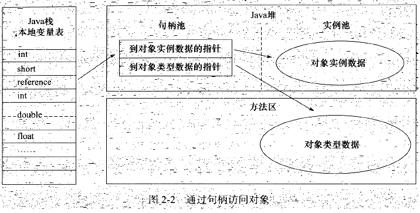
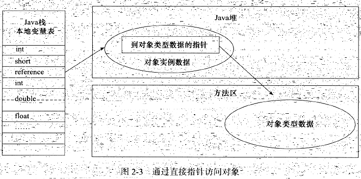

## JVM 内存区域

### 程序计数器

java 多线程的实现依赖该计数器，是唯一 Java 虚拟机中不会发生 OutOfMemoryError 的区域。

### java 虚拟机栈

用于存储局部变量表，操作数帧，动态链接，方法出口等信息。

### 本地方法栈

与 Java 虚拟机栈类似，不过 Java 虚拟机栈存放的是 Java 方法 （字节码） ，而本地方法栈存放的是 Native 方法。

在 Hotspot VM 中，Java 虚拟机栈和本地方法栈是合二为一的。

Java 虚拟机栈和本地方法栈都会报 StackOverflowError 和 OutOfMemoryError 异常。

### Java 堆

是 GC 的主要区域，用于存放 Java 对象实例。

分为新生代和老年代，细分还有 Eden 空间、From Survivor 空间、To Survivor 空间等。

通过 -Xmx 和 -Xms 控制。

会报 OutOfMemoryError 异常。

### 方法区

用于存放类信息、常量、静态变量、即时编译器编译后的代码等信息，又称为 Non-Heap，区别于 Java 堆。

又称为永久代，在 Java 7 之后有逐步移除的趋势（已将字段常量从方法区中移除），将逐步以 Native Memory 的形式替代。

通过 -XX:MaxPermSize 等参数控制

会报 OutOfMemoryError 异常。

#### 运行时常量池

方法区的一部分，使用较多的为 String.intern() 方法。

会报 OutOfMemoryError 异常。

### 直接内存

直接内存不是虚拟机运行时数据区的一部分，也不是 Java 虚拟机规范定义的内存区域，不会受 Java 堆大小的限制，仅受本机总内存限制。

使用 Native 函数库直接分配堆外内存，常用于 NIO （Java 1.4+），一般如发现 dump 文件大小较小，且出现 OOM 的情况，可以往这方面考虑。

使用各内存区域总和大于物理内存限制，会报 OutOfMemoryError 异常。 

## 对象的方法方式

主流的访问方式为句柄和直接指针两种。

Hotspot VM 里采用的是直接指针。

## Reference

《深入理解 Java 虚拟机 JVM 高级特性与最佳实践》

