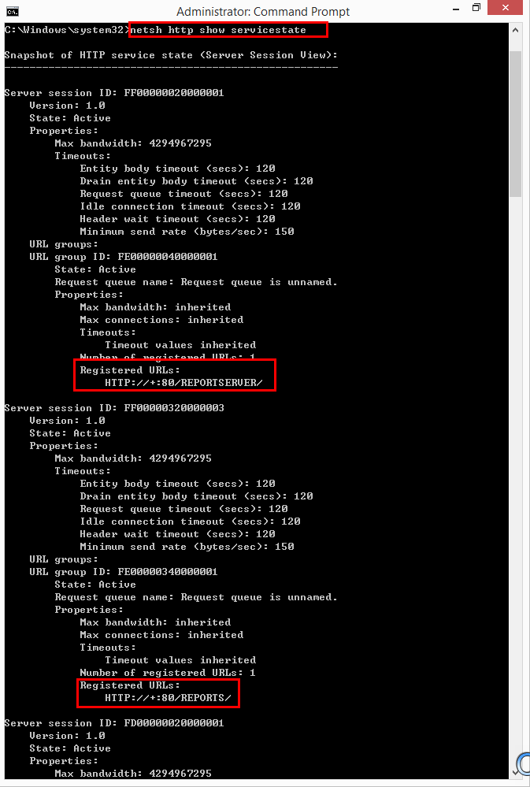
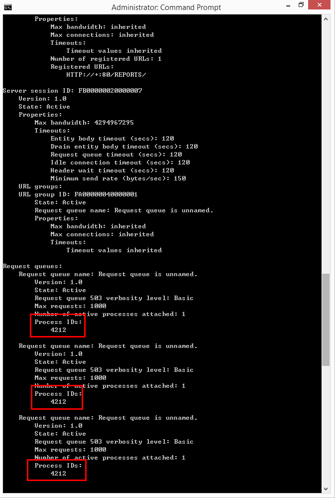
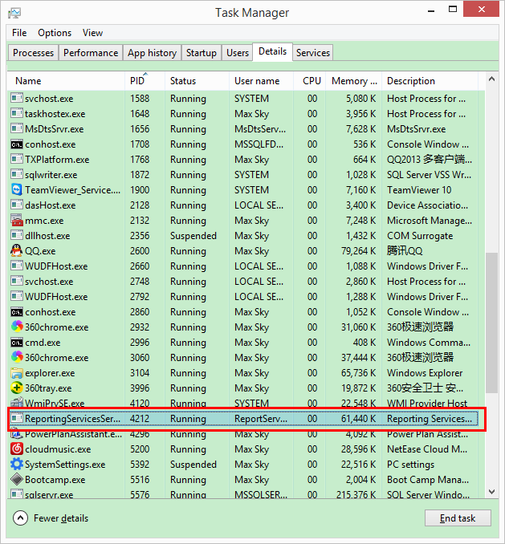

## 查看端口占用进程

```shell script
netstat -ano | findstr 8080
```

### 查看进程任务

```shell script
tasklist | findstr $pid

# sample of killing task
taskkill /f /t /im /javaw.exe
```

### 参考

https://blog.csdn.net/jiangwei0910410003/article/details/18967441


## Windows 下 80 端口被进程 System & PID=4 占用的解决方法

### 查看 http 服务状态

```
netsh http show servicestate
```



在往下看就能看到占用的进程ID



### taskmgr 查看进程详情（描述）



### 系统服务

```
services.msc
```

### 参考

https://blog.csdn.net/maxsky/article/details/45725109